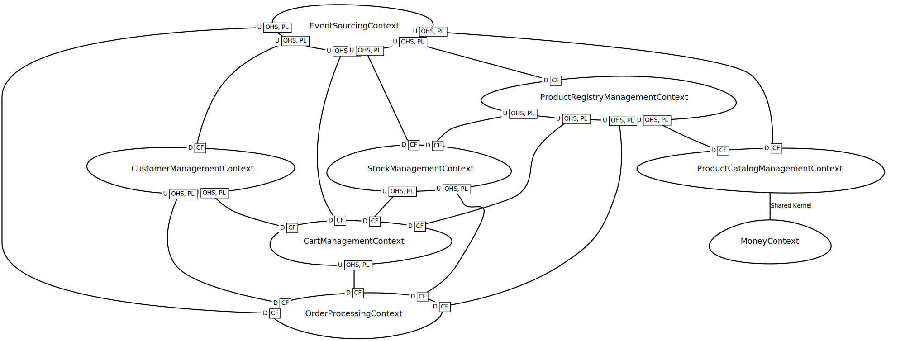

# Order flow project presentation

This document presents the order flow project. It describes the project's context, objectives, and purpose.

## Context

The order flow project is a simplified application of e-commerce platform that allows customers to place orders for products or services. It relies on several microservices to manage the order lifecycle as well as related domains.

## Objectives

The objectives of the order flow project are to help you understand the following concepts:
- Microservices architecture
- Domain-driven design
- Event-driven architecture
- Quality concepts in software engineering

## Purpose

The purpose of the order flow project is to provide you with a practical work that will help you to:
- Understand the order flow application and its microservices
- Improve the application's design and implementation quality
- Apply quality concepts in software engineering
- Prepare a material for it to be evaluated

## Order flow application

::: warning
Don't try to learn all the details of the order flow application nor the domain driven design at once. Instead, focus on understanding the main concepts and how they are implemented in the microservices.
:::

::: tip
Don't hesitate to ask questions if you need more information.
:::

## Business domain

The order flow application relies on a main domain `Online Shopping` that encompass several core, supporting and generic domains (cf https://alexsoyes.com/ddd-domain-driven-design/) (cf `/doc/business/domain.cml`):

- Core domains:
  - Shopping cart
  - Order processing
- Supporting domains:
  - Product registry
  - Product catalog
  - Stock management
  - Customer management
- Generic domains:
  - Notification
  - Event sourcing
  - Money

## Context mapping

The context mapping of the order flow application is represented by the following diagram (cf `/doc/business/context-mapping.cml`):

## Microservices and libs architecture

The order flow application is composed of several microservices implementing the domains in a CQRS and event-driven pattern.

- Core services:
  - Shopping cart service:
    - Aggregates
    - Commands
    - Queries
  - Order processing service:
    - Aggregates
    - Commands
    - Queries
- Supporting services:
  - Product registry service:
    - Aggregate (unique: there is a single registry for simplicity)
    - Commands
    - Queries
  - Product catalog service
    - Aggregates
    - Commands
    - Queries
  - Stock management service
    - Aggregate (unique: there is a single stock for simplicity)
    - Commands
    - Queries
  - Customer management service
    - Aggregates
    - Commands
    - Queries
- Generic services:
  - Notification service
    - Commands
    - Queries
  - Event sourcing:
    - Event interface
    - Event store interface
  - Money:
    - Value object

## Messaging, event sourcing, CQRS

The order flow application relies on messaging and event sourcing to communicate between microservices.

### Messaging system

Messaging communication is a system of sending messages between microservices. It is used to communicate between microservices in a decoupled way. You are probably familiar with synchronous communication (HTTP REST API) but messaging is asynchronous and works differently.

Messaging works with a message broker that is responsible for receiving, storing, and forwarding messages. The message broker is a middleware that allows microservices to communicate with each other.

When a system component sends a message, it sends it to the message broker. The message broker then forwards the message to the recipient microservice based on specific configuration. The recipient microservice processes the message and sends a response back to the message broker. The message broker then forwards the response back to any interested system components being the sender or not.

#### Message broker

The message broker used in the order flow application is Apache Pulsar. Apache Pulsar is a distributed messaging and event streaming platform that is used to send and receive messages between microservices.

A particularity of Apache Pulsar is that it does not natively supports request-reply pattern. Instead, it uses a publish-subscribe pattern where a producer sends messages to a topic and a consumer receives messages from the topic. For request-reply pattern, you need to implement it yourself. This is what is done by using a correlation ID in the message.

### Event sourcing

Event sourcing is a pattern that is used to store the state of an application as a sequence of events. It is used to store the state of the application in a way that is easy to understand and easy to change.

When an event is created, it is stored in an event store. The event store is a database that stores the events in a way that is easy to query and easy to change. When a new event is created, it is appended to the event store. This allows you to see the history of the application and to see how the application has changed over time.

Event sourcing is used in the order flow application to store the state of the aggregates and entities. When a command is received by a microservice, it is processed and an event is created. The event is then stored in the event store. If a command is received on a different component, it can read the event store to get the current state of the application. So it is a way to share the state of the application between microservices and to keep the state consistent.

In the order flow application, the event sourcing is implemented with NoSQL Document collections as event stores, using MongoDB.

### CQRS

In addition to event sourcing, the order flow application uses the CQRS pattern. CQRS stands for Command Query Responsibility Segregation. It is a pattern that is used to separate the read and write operations of an application.

Advantages of CQRS are that it allows to optimize the read and write operations separately, to scale the read and write operations independently, and to simplify the code by separating the read and write operations.

Although CQRS is a powerful pattern, it is also complex and can be difficult to implement, especially in a distributed and asynchronous system when it comes to consistency : in such system, consistency is eventual and not immediate. It means that the state of the application is not immediately consistent between microservices but will be consistent at some point in the future.

But another advantage of CQRS is that it compensates event sourcing slowness of state rebuilding by replaying events from the event store by using an alternative read model which stores the state of the application in a way that is easier to query.

In the order flow application, the CQRS pattern is implemented using Pulsar messaging system for commands and queries, and MongoDB for the read model.

[Additionnal information on CQRS (Martin fowler)](https://martinfowler.com/bliki/CQRS.html)
[How to apply CQRS pattern step by step (Daniel Whittaker)](https://danielwhittaker.me/2020/02/20/cqrs-step-step-guide-flow-typical-application/)